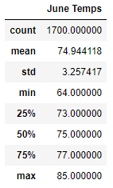
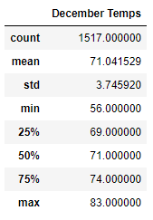

# Surfs Up

## Overview

While on vacation to Hawaii last year, i became passionate about surfing. I decided to open a surf and ice cream shop so that i can live there forever. In order to secure investment for the plan, i met an investor W. Avy. He is really interested in the plan but concerned about weather as one of his early investments in a surf shop failed because of bad weather. He has asked me to run an analytics on the weather dataset he has for island of Oahu.    

He liked the analysis i did on the weather earlier, but he wants more information about temperature trends. In particular, he likes to analysis of temperature data for month of June and December.  

## Results

**Summary Statistics for June Temperatures**

**Summary Statistics for December Temperatures**

**Observations**

1. The count of temperatures for June are more than count for temperatures for December even though December has 1 day extra (31st). Therefore the data for June was more actively recorded than December. The count for June (1700), which is about 12% more than count for December (1517).    

2. The minimum temperature for June is 64, whereas the minimum temperature for December is 56. However, there is not much difference in maximum temperature and mean for June and December. This shows than even though Oahu has tropical hot climate, there are occasionally days with mild temperature in December.

3. The difference between 25th and 75th percentile is 4 for June and 5 for December. It shows that the temperature does not vary much for majority of June and December. Therefore, it can be said that temperature remains stable for most of these two months.

## Summary